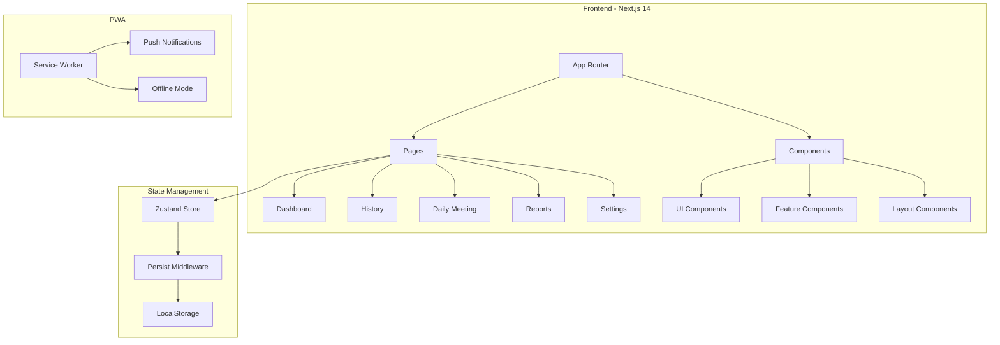
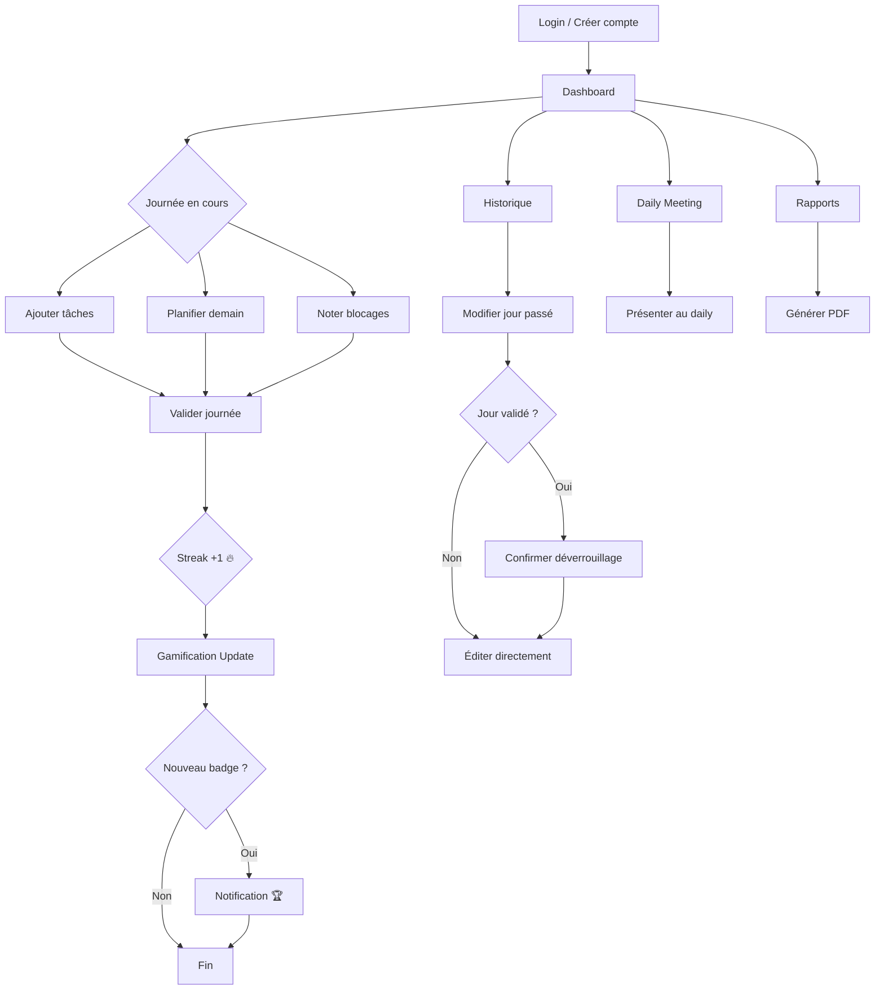
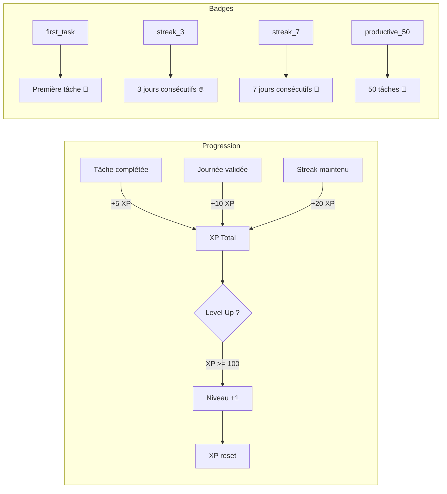
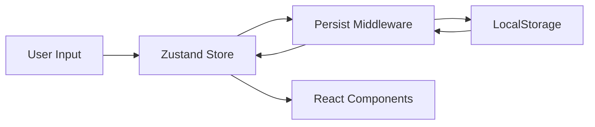

# 📊 Daily Tracker

**Application mobile-first pour préparer vos Daily Scrum en toute simplicité.**


## 🎯 À propos

Daily Tracker est une application web progressive (PWA) conçue pour les développeurs et équipes agiles. Elle permet de :

- ✅ **Tracker ses tâches** quotidiennes par catégorie
- 📋 **Planifier** les tâches du lendemain
- 🎤 **Présenter** son daily en mode optimisé
- 📄 **Exporter** des rapports PDF professionnels
- 🔥 **Maintenir** un streak de productivité
- 🏆 **Gagner** des badges et monter en niveau

## 🏗️ Architecture globale



## 📂 Structure du projet

```
📁 daily-tracker/
├── 📁 app/
│   ├── 📁 dashboard/       # Page principale
│   │   └── README.md       # Documentation
│   ├── 📁 history/         # Historique calendrier
│   │   └── README.md
│   ├── 📁 daily-meeting/   # Mode présentation
│   │   └── README.md
│   ├── 📁 reports/         # Export PDF
│   │   └── README.md
│   ├── 📁 settings/        # Paramètres
│   │   └── README.md
│   ├── 📁 api/             # Routes API
│   ├── layout.tsx          # Layout principal
│   └── page.tsx            # Login
├── 📁 components/
│   ├── 📁 ui/              # Composants réutilisables
│   ├── 📁 features/        # Composants métier
│   └── 📁 layout/          # Navigation, AppLayout
├── 📁 lib/
│   ├── store.ts            # Store Zustand
│   └── utils.ts            # Utilitaires
├── 📁 types/
│   └── index.ts            # Types TypeScript
├── 📁 public/
│   ├── manifest.json       # PWA manifest
│   └── sw.js               # Service worker
└── README.md
```

## 🚀 Installation

```bash
# Cloner le repo
git clone https://github.com/abderrzakseghir/Daily-Tracker.git
cd Daily-Tracker

# Installer les dépendances
npm install

# Lancer en développement
npm run dev
```

L'application sera disponible sur [http://localhost:3000](http://localhost:3000)

## 🔧 Scripts disponibles

| Commande | Description |
|----------|-------------|
| `npm run dev` | Démarre le serveur de développement |
| `npm run build` | Build de production |
| `npm run start` | Lance le serveur de production |
| `npm run lint` | Analyse le code avec ESLint |

## 📱 Flux utilisateur principal



## 🎮 Système de gamification



## 🛠️ Technologies

| Technologie | Usage |
|-------------|-------|
| **Next.js 14** | Framework React avec App Router |
| **TypeScript** | Typage statique |
| **Tailwind CSS** | Styling utilitaire |
| **Zustand** | State management |
| **Chart.js** | Graphiques |
| **jsPDF** | Génération PDF |
| **date-fns** | Manipulation de dates |
| **Framer Motion** | Animations |
| **Lucide React** | Icônes |

## 📖 Documentation par page

Chaque page dispose de sa propre documentation avec diagrammes Mermaid :

- [Dashboard](app/dashboard/README.md) - Page principale
- [Historique](app/history/README.md) - Calendrier et édition
- [Daily Meeting](app/daily-meeting/README.md) - Mode présentation
- [Rapports](app/reports/README.md) - Export PDF
- [Paramètres](app/settings/README.md) - Configuration

## 🔐 Sécurité

- Authentification par code PIN (4-6 chiffres)
- Données stockées localement dans le localStorage
- Aucune donnée envoyée à un serveur externe par défaut

## Variables d'environnement (optionnel)

Créez un fichier `.env.local` pour activer les fonctionnalités cloud :

```env
# Vercel Blob Storage (optionnel)
BLOB_READ_WRITE_TOKEN=votre_token

# Web Push (optionnel)
NEXT_PUBLIC_VAPID_PUBLIC_KEY=votre_cle_publique
VAPID_PRIVATE_KEY=votre_cle_privee
VAPID_SUBJECT=mailto:votre@email.com
```

## 🎨 Thème

L'application supporte le mode sombre/clair avec trois options :
- 🌙 **Sombre** - Interface dark
- ☀️ **Clair** - Interface light
- 💻 **Système** - Suit les préférences OS

## 📱 PWA

Daily Tracker est installable comme application native :

1. Ouvrir l'application dans Chrome/Edge
2. Cliquer sur "Installer" dans la barre d'adresse
3. L'app apparaît dans vos applications

### Fonctionnalités PWA

- ✅ Installation sur écran d'accueil
- ✅ Fonctionnement hors-ligne
- ✅ Notifications push (rappels de validation)
- ✅ Icônes adaptatives

## 📊 Flux de données



## 📄 Licence

MIT - Libre d'utilisation et de modification.

---

Développé avec ❤️ pour les équipes agiles
