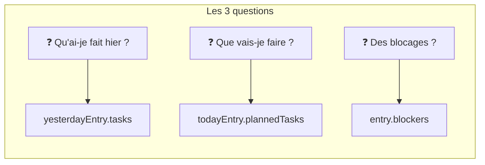
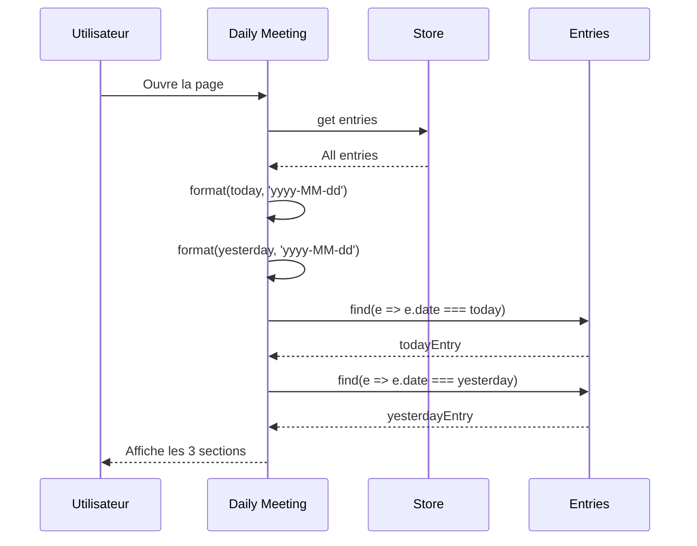
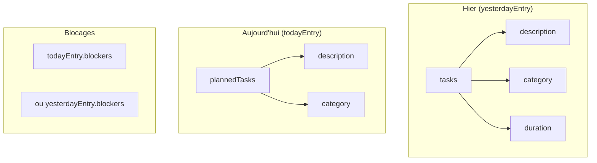
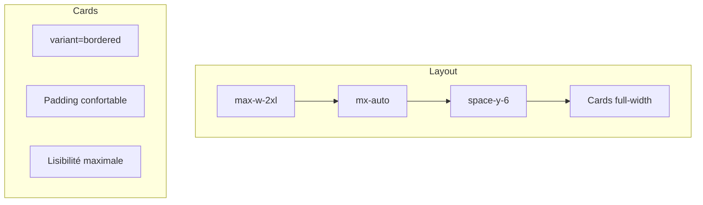
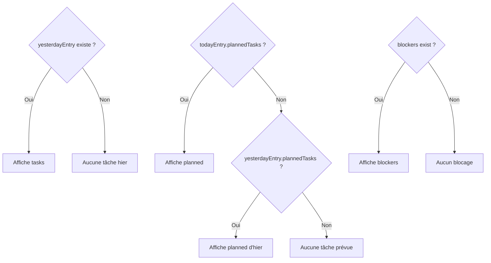

# Daily Meeting - Mode Présentation

## Description

La page **Daily Meeting** offre une vue optimisée pour les réunions Daily Scrum. Elle affiche clairement les trois questions classiques du daily : ce qui a été fait, ce qui va être fait, et les blocages.

## Fonctionnalités

- 🎯 Vue centrée et épurée
- 📝 Hier : tâches réalisées
- 📋 Aujourd'hui : tâches prévues
- ⚠️ Blocages en évidence
- 📱 Parfait pour présentation écran

## Architecture

```mermaid
graph TB
    subgraph "Daily Meeting Page"
        A[Page Daily Meeting] --> B[Header centré]
        A --> C[Card Hier]
        A --> D[Card Aujourd'hui]
        A --> E[Card Blocages]
        
        B --> B1[Icône Presentation]
        B --> B2[Titre "Mode Daily Meeting"]
        B --> B3[Date du jour]
        
        C --> C1[Titre avec icône ✅]
        C --> C2[Stats: N tâches, Xh]
        C --> C3[Liste des tâches]
        
        D --> D1[Titre avec icône 🕐]
        D --> D2[Liste plannedTasks]
        
        E --> E1[Titre avec icône ⚠️]
        E --> E2[Texte des blocages]
    end
```

## Format Daily Scrum



## Flux de données



## Structure des données affichées



## Composants utilisés

| Composant | Description |
|-----------|-------------|
| `DailyMeetingView` | Composant principal d'affichage |
| `Card` | Container pour chaque section |
| `Badge` | Catégorie des tâches |
| `ChevronRight` | Icône de liste |

## Style de présentation



## Icônes par section

| Section | Icône | Couleur |
|---------|-------|---------|
| Hier | ✅ CheckCircle | Vert success |
| Aujourd'hui | 🕐 Clock | Bleu accent |
| Blocages | ⚠️ AlertTriangle | Orange warning |

## Cas de fallback



## Code exemple

```tsx
// Récupération des entrées
const today = format(new Date(), 'yyyy-MM-dd');
const yesterday = format(subDays(new Date(), 1), 'yyyy-MM-dd');

const todayEntry = entries.find((e) => e.date === today);
const yesterdayEntry = entries.find((e) => e.date === yesterday);

// Affichage
<DailyMeetingView
  todayEntry={todayEntry}
  yesterdayEntry={yesterdayEntry}
/>
```

## Conseils d'utilisation

1. **Ouvrir juste avant le daily** - Les données sont à jour
2. **Partager son écran** - Vue optimisée pour la visibilité
3. **Lire de haut en bas** - Suit le format classique du daily
4. **Mentionner les blocages** - Section mise en évidence en orange
