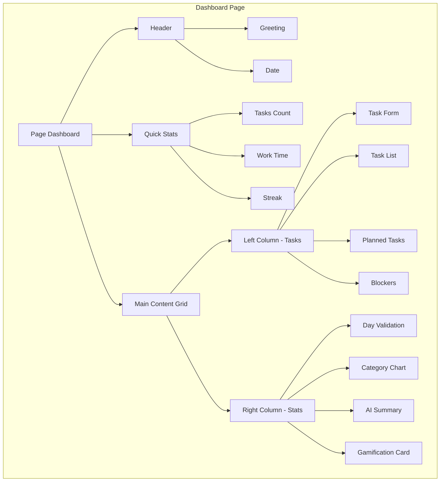
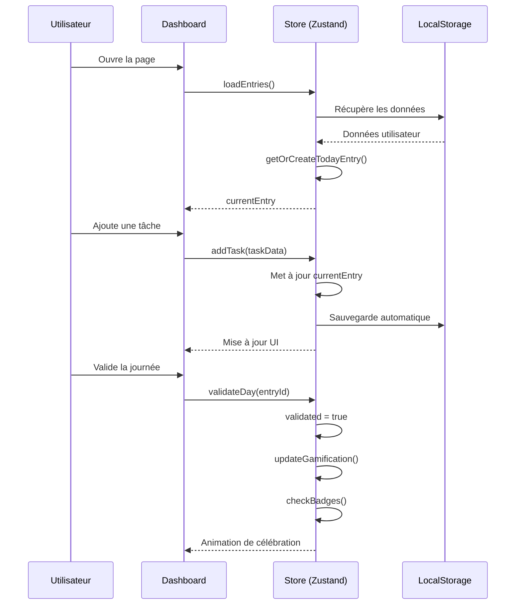
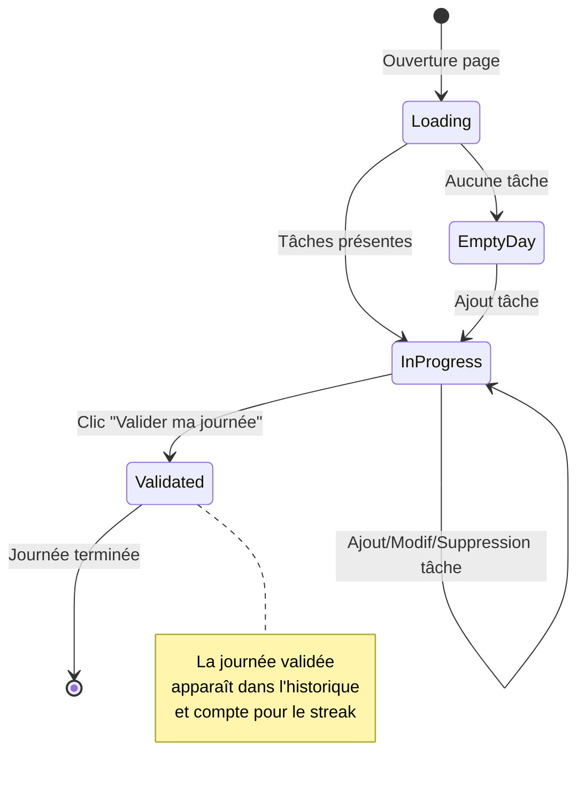
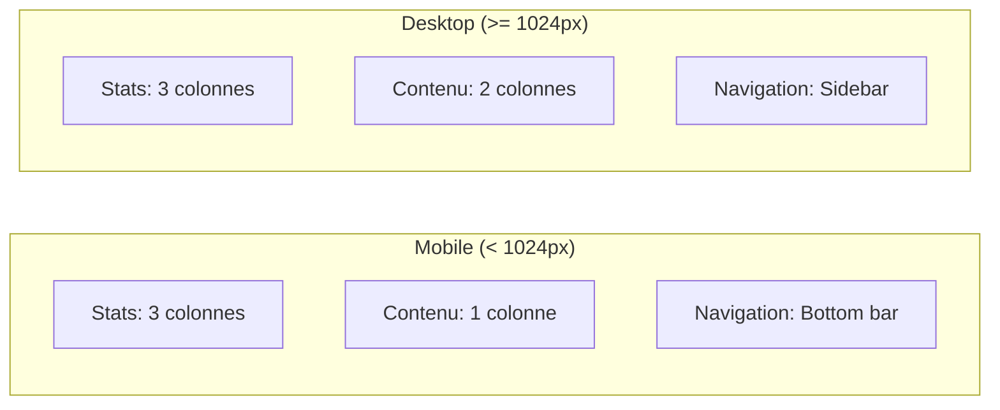

# Dashboard - Page Principale

## Description

La page **Dashboard** est le cœur de l'application Daily Tracker. Elle permet de gérer votre journée en temps réel : ajouter des tâches, suivre le temps de travail, et valider votre journée pour maintenir votre streak.

## Fonctionnalités

- ✅ Ajouter des tâches réalisées avec catégorie et durée
- 📋 Planifier les tâches de demain
- ⚠️ Noter les blocages rencontrés
- 🎯 Valider la journée
- 📊 Visualiser les statistiques en temps réel
- 🔥 Suivre le streak et la gamification

## Architecture



## Flux de données



## Composants utilisés

| Composant | Fichier | Description |
|-----------|---------|-------------|
| TaskForm | `components/features/task-form.tsx` | Formulaire d'ajout/édition de tâche |
| TaskCard | `components/features/task-card.tsx` | Affichage d'une tâche avec actions |
| PlannedTaskList | `components/features/planned-task-list.tsx` | Liste des tâches prévues |
| DayValidation | `components/features/day-validation.tsx` | Bouton et stats de validation |
| CategoryChart | `components/features/category-chart.tsx` | Graphique de répartition |
| GamificationCard | `components/features/gamification-card.tsx` | Niveau, XP, badges |

## États du Dashboard



## Catégories disponibles

| Catégorie | Couleur | Icône |
|-----------|---------|-------|
| Développement | 🔵 Bleu | Code |
| Réunion | 🟣 Violet | Users |
| Support | 🟠 Orange | HelpCircle |
| Formation | 🟢 Vert | GraduationCap |
| Documentation | 🔵 Cyan | FileText |
| Recherche | 🩷 Rose | Search |
| Personnel | 🟣 Indigo | User |
| Autre | ⚫ Gris | MoreHorizontal |

## Durées prédéfinies

- ⏱️ 15 minutes
- ⏱️ 30 minutes
- 🕐 1 heure
- 🕑 2 heures
- 🕓 4 heures
- ⏱️ Personnalisé (en minutes)

## Responsive Design



## Code exemple

```tsx
// Ajouter une tâche
addTask({
  description: "Correction bug authentification",
  category: "development",
  duration: "2h",
  completed: false
});

// Valider la journée
await validateDay(currentEntry.id);
```
