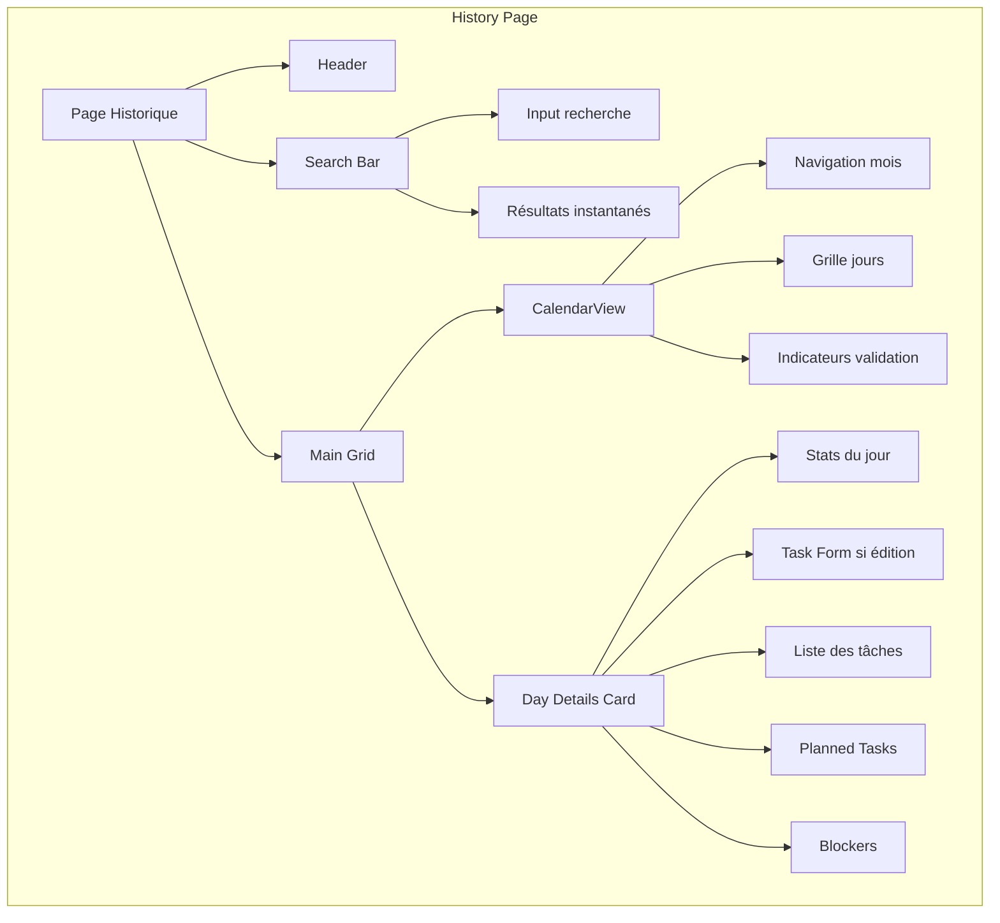
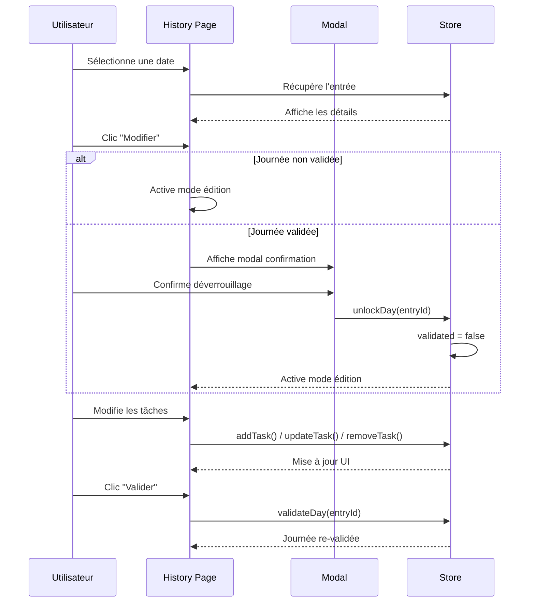
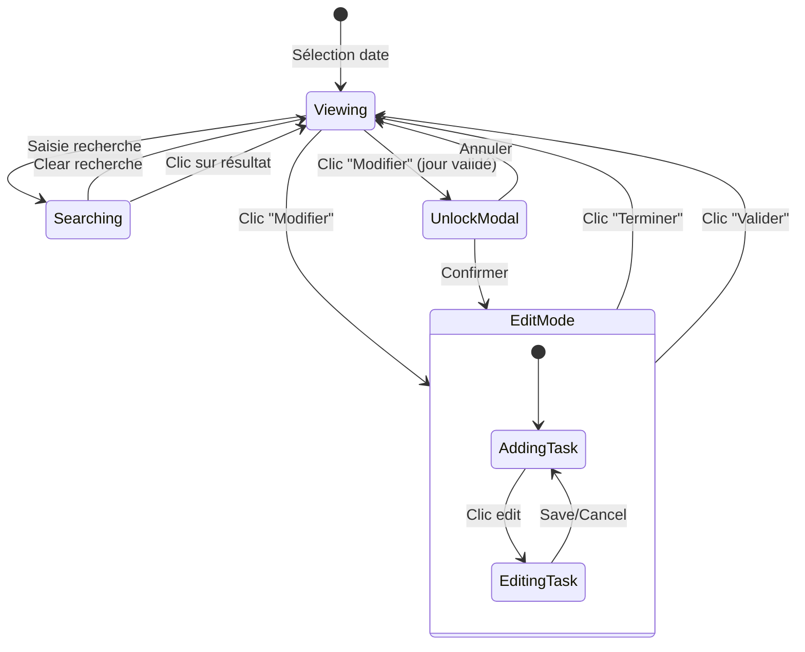
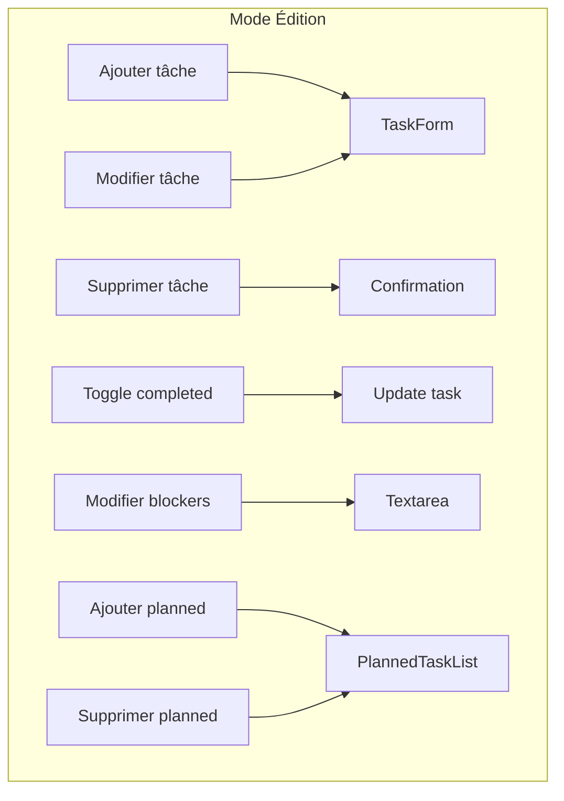

# Historique - Calendrier et Recherche

## Description

La page **Historique** permet de naviguer dans vos journées passées grâce à un calendrier interactif. Vous pouvez consulter, rechercher et **modifier** n'importe quelle journée, même validée.

## Fonctionnalités

- 📅 Vue calendrier mensuelle
- 🔍 Recherche par mot-clé
- ✏️ Modification des journées passées
- 🔓 Déverrouillage des journées validées
- 📊 Visualisation des statistiques par jour

## Architecture



## Flux de modification d'une journée



## États de la page



## Recherche intelligente

La recherche parcourt :
- Les descriptions des tâches
- Les catégories
- Les tâches planifiées
- Les blocages

```mermaid
graph LR
    A[Query: "bug"] --> B{Filtrage}
    B --> C[Tasks.description]
    B --> D[Category labels]
    B --> E[PlannedTasks]
    B --> F[Blockers]
    
    C --> G[Résultats fusionnés]
    D --> G
    E --> G
    F --> G
    
    G --> H[Affichage instantané]
```

## Composants clés

| Composant | Description |
|-----------|-------------|
| `CalendarView` | Calendrier mensuel avec navigation |
| `TaskCard` | Affichage de tâche avec mode édition |
| `TaskForm` | Formulaire d'ajout/modification |
| `PlannedTaskList` | Liste des tâches prévues |
| `Modal` | Confirmation de déverrouillage |

## Actions disponibles en mode édition



## Icônes et états

| État | Icône | Description |
|------|-------|-------------|
| Validé | 🔒 Lock (vert) | Journée verrouillée |
| Non validé | 🔓 Unlock (orange) | Modifiable directement |
| Aujourd'hui | Ring bleu | Date actuelle |
| Avec entrée | ✅ Check | Journée avec données |

## Code exemple

```tsx
// Déverrouiller une journée
const handleUnlockAndEdit = async () => {
  await unlockDay(selectedEntry.id);
  setCurrentEntry(selectedEntry.id);
  setIsEditing(true);
};

// Rechercher
const results = entries.filter((entry) => {
  return entry.tasks.some(task => 
    task.description.toLowerCase().includes(query)
  );
});
```
