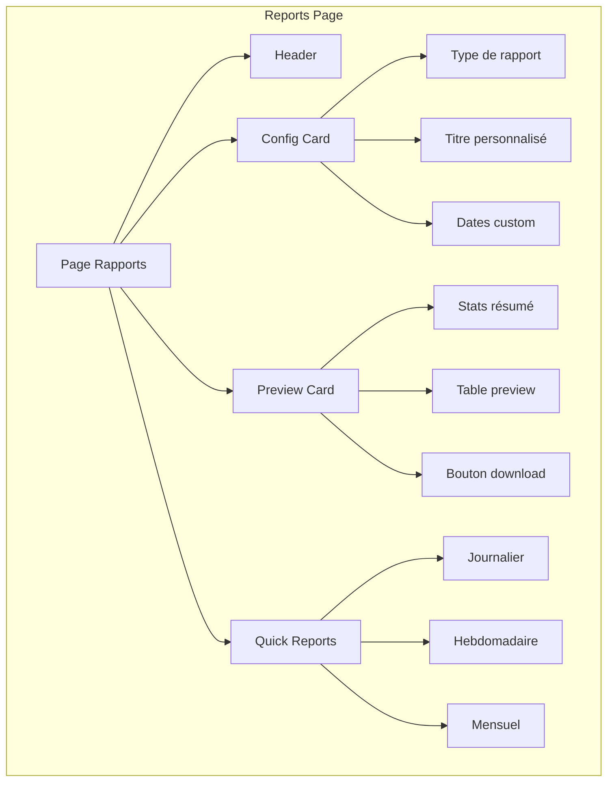
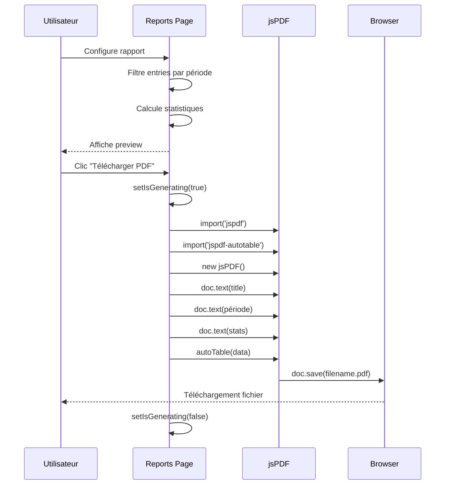
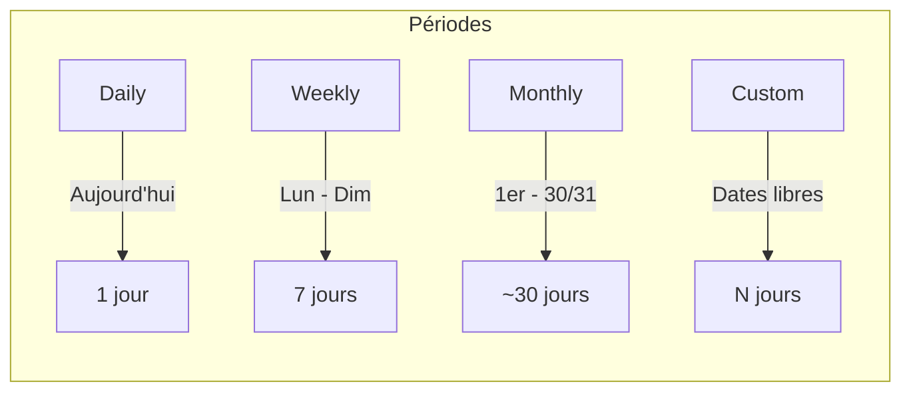
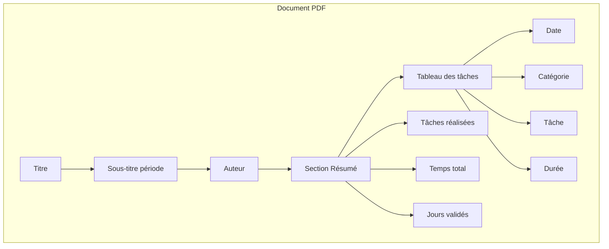
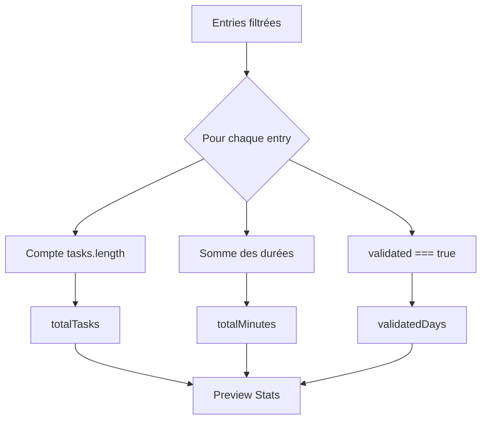
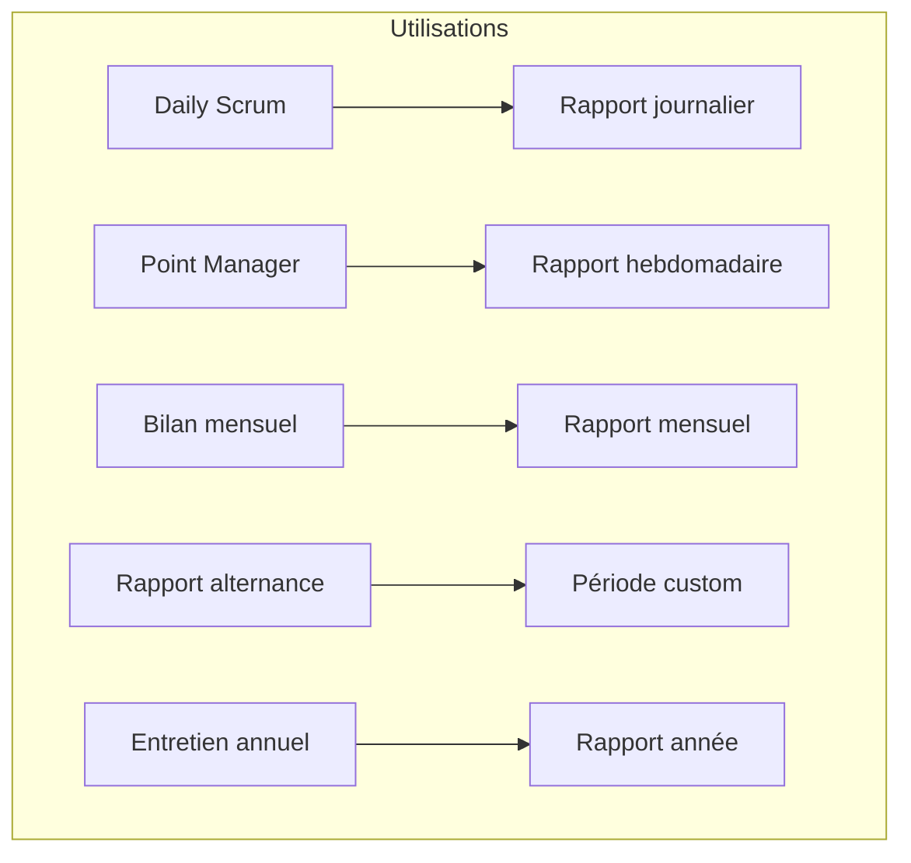

# Rapports - Export PDF

## Description

La page **Rapports** permet de générer des documents PDF professionnels à partir de vos données. Idéal pour les points avec votre manager, les bilans mensuels ou votre rapport d'alternance.

## Fonctionnalités

- 📄 Génération PDF avec jsPDF
- 📅 Rapports journalier/hebdomadaire/mensuel
- 🗓️ Période personnalisée
- 📊 Statistiques incluses
- 🎨 Mise en page professionnelle

## Architecture



## Flux de génération PDF



## Types de rapports



## Structure du PDF généré



## Calculs effectués



## Personnalisation

| Option | Description |
|--------|-------------|
| Type | daily, weekly, monthly, custom |
| Titre | Texte personnalisé optionnel |
| Date début | Pour période custom |
| Date fin | Pour période custom |

## Aperçu du tableau

| Date | Catégorie | Tâche | Durée |
|------|-----------|-------|-------|
| 15/06/2026 | Développement | Correction bug auth | 2h |
| 15/06/2026 | Réunion | Point équipe | 30min |
| 14/06/2026 | Support | Ticket client | 1h |

## Code exemple

```tsx
// Génération PDF
const handleGeneratePDF = async () => {
  const { default: jsPDF } = await import('jspdf');
  const { default: autoTable } = await import('jspdf-autotable');

  const doc = new jsPDF();
  
  // Titre
  doc.setFontSize(20);
  doc.text('Rapport Daily Tracker', 20, 20);
  
  // Table
  autoTable(doc, {
    startY: 85,
    head: [['Date', 'Catégorie', 'Tâche', 'Durée']],
    body: tableData,
    theme: 'striped',
    headStyles: { fillColor: [59, 130, 246] },
  });

  doc.save('rapport.pdf');
};
```

## Cas d'usage


