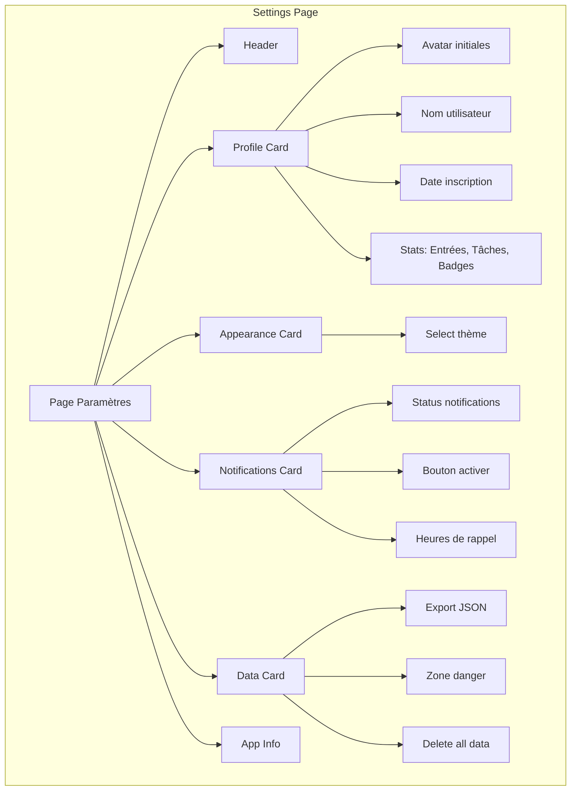
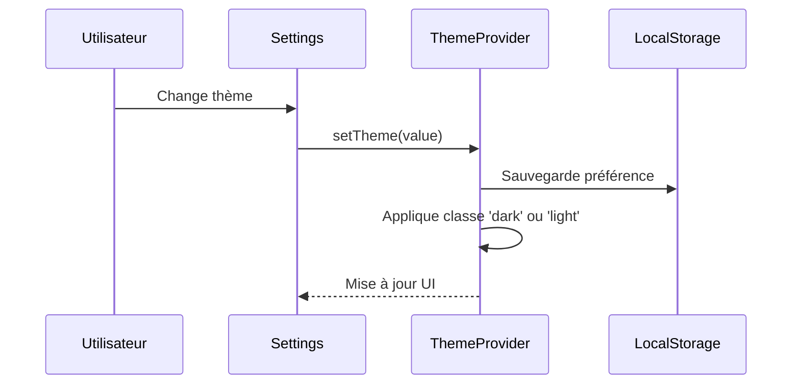
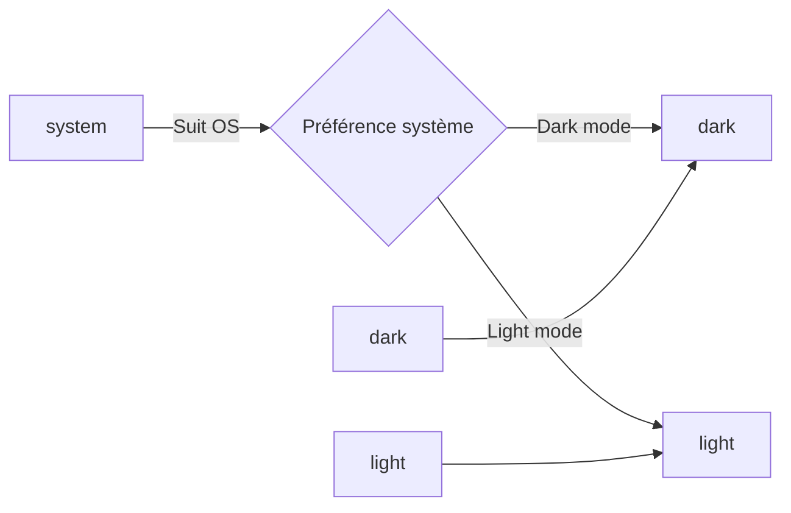
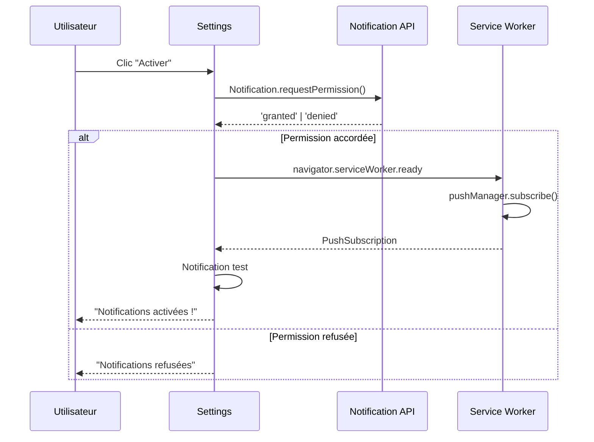
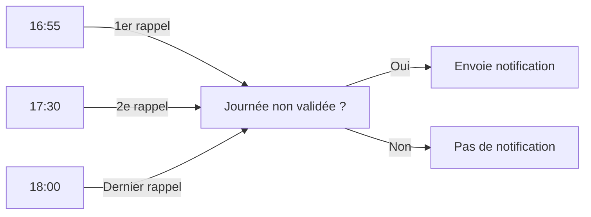
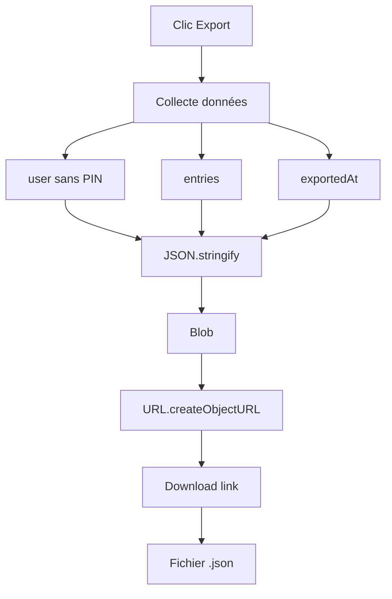

# Paramètres - Configuration

## Description

La page **Paramètres** permet de personnaliser l'application : profil, thème, notifications et gestion des données.

## Fonctionnalités

- 👤 Affichage du profil utilisateur
- 🎨 Choix du thème (clair/sombre/système)
- 🔔 Configuration des notifications push
- 💾 Export des données en JSON
- 🗑️ Suppression des données

## Architecture



## Gestion du thème



## Options de thème



## Notifications Push



## Heures de rappel par défaut



## Export des données



## Structure de l'export

```json
{
  "user": {
    "id": "uuid",
    "name": "Prénom",
    "settings": { ... },
    "gamification": { ... },
    "createdAt": "2026-06-01T..."
  },
  "entries": [
    {
      "id": "uuid",
      "date": "2026-06-15",
      "tasks": [ ... ],
      "validated": true
    }
  ],
  "exportedAt": "2026-06-15T18:00:00Z"
}
```

## Zone de danger

```mermaid
graph TB
    A[Clic "Supprimer mes données"] --> B{Confirmation}
    B -->|Annuler| C[Rien]
    B -->|Confirmer| D[localStorage.clear]
    D --> E[Redirect vers /]
    E --> F[Nouveau compte possible]
```

## Composants utilisés

| Composant | Description |
|-----------|-------------|
| `Card` | Container pour chaque section |
| `Select` | Sélection du thème |
| `Button` | Actions (export, delete) |
| `Badge` | Status notifications |

## États des notifications

| État | Badge | Action |
|------|-------|--------|
| Non supporté | - | Message d'erreur |
| Non demandé | - | Bouton "Activer" |
| Accordé | ✅ Activées | Affiche heures |
| Refusé | - | Instructions manuelles |

## Code exemple

```tsx
// Changement de thème
const { theme, setTheme } = useTheme();
setTheme('dark'); // ou 'light' ou 'system'

// Export données
const handleExportData = () => {
  const data = {
    user: { ...user, pin: undefined },
    entries,
    exportedAt: new Date().toISOString(),
  };
  
  const blob = new Blob([JSON.stringify(data, null, 2)], {
    type: 'application/json',
  });
  
  // Téléchargement...
};

// Suppression
const handleDeleteAll = () => {
  if (confirm('Êtes-vous sûr ?')) {
    localStorage.clear();
    router.push('/');
  }
};
```

## Informations de l'app

- Version : 1.0.0
- Développé avec ❤️ pour les équipes agiles
